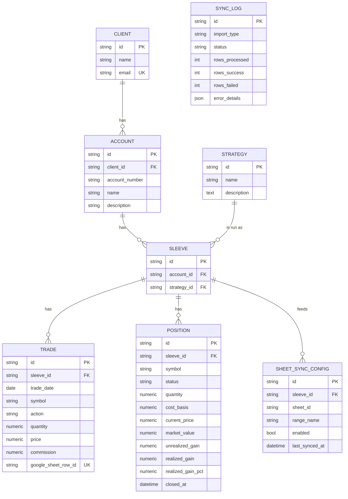

# PMS Data Model

Current schema after the **Sleeve refactor** (migration `fe521b07fb54`). All primary keys are
`String(36)` UUIDs. Timestamps (`created_at`, `updated_at`) are timezone-aware via `BaseModel`.

## Hierarchy at a glance

```
Client ──< Account ──< Sleeve >── Strategy        (Sleeve = account × strategy instance)
                          │
                          ├──< Trade
                          ├──< Position
                          └──< SheetSyncConfig

SyncLog                                            (standalone import/sync audit trail)
```

- A **Strategy** is a firm-wide *definition* ("Growth", "Income") — reusable across accounts
  and clients.
- A **Sleeve** is one strategy *as run in one account*. It's the join between `Account` and
  `Strategy`, and it owns trades, positions and sync configs.
- One Strategy → many Sleeves (same strategy across many accounts/clients).
- One Account → many Sleeves (an account runs several strategies).

## ER diagram



## Tables

### `clients`
| Column | Type | Notes |
|---|---|---|
| id | String(36) PK | uuid |
| name | String(255) | not null |
| email | String(255) | not null, **unique** |

Relationships: `accounts` (1→N, cascade delete).

### `accounts`
| Column | Type | Notes |
|---|---|---|
| id | String(36) PK | uuid |
| client_id | String(36) FK→clients.id | not null, **ON DELETE CASCADE** |
| account_number | String(50) | nullable (e.g. "58168069") |
| name | String(255) | not null |
| description | String(500) | nullable |

Relationships: `client` (N→1), `sleeves` (1→N, cascade delete).

### `strategies`  *(firm-wide definition)*
| Column | Type | Notes |
|---|---|---|
| id | String(36) PK | uuid |
| name | String(255) | not null; **unique case-insensitively** |
| description | Text | nullable |

Constraints: unique functional index `uq_strategy_name_lower` on `lower(name)` — "Growth"
and "growth" are the same definition. Relationships: `sleeves` (1→N). No
`account_id`/`client_id` — a strategy is global.

### `sleeves`  *(account × strategy instance)*
| Column | Type | Notes |
|---|---|---|
| id | String(36) PK | uuid |
| account_id | String(36) FK→accounts.id | not null, **ON DELETE CASCADE** |
| strategy_id | String(36) FK→strategies.id | not null, **ON DELETE RESTRICT** |

Constraints: `UNIQUE(account_id, strategy_id)` — one sleeve per strategy per account.
`RESTRICT` on `strategy_id` prevents deleting a strategy definition that still has live
sleeves. Relationships: `account`, `strategy` (N→1); `trades`, `positions` (1→N, cascade).

### `trades`
| Column | Type | Notes |
|---|---|---|
| id | String(36) PK | uuid |
| sleeve_id | String(36) FK→sleeves.id | not null, **ON DELETE CASCADE** |
| trade_date | Date | not null |
| symbol | String(20) | not null |
| action | String(10) | not null; check `IN ('BUY','SELL')` |
| quantity | Numeric(15,6) | not null; check `> 0` |
| price | Numeric(15,6) | not null; check `> 0` |
| commission | Numeric(15,6) | default 0 |
| notes | String(500) | nullable |
| google_sheet_row_id | String(255) | **unique**; null for CSV-sourced trades |

### `positions`
| Column | Type | Notes |
|---|---|---|
| id | String(36) PK | uuid |
| sleeve_id | String(36) FK→sleeves.id | not null, **ON DELETE CASCADE** |
| symbol | String(20) | not null |
| status | String(10) | not null, default `OPEN`; `OPEN` or `CLOSED` |
| quantity | Numeric(15,6) | not null (0 for closed rows) |
| cost_basis | Numeric(18,2) | not null (0 for closed rows) |
| current_price | Numeric(15,6) | nullable (persisted market price) |
| market_value | Numeric(18,2) | nullable |
| unrealized_gain | Numeric(18,2) | nullable (open positions only) |
| realized_gain | Numeric(18,2) | nullable (set on closed rows) |
| realized_gain_pct | Numeric(10,4) | nullable (set on closed rows) |
| closed_at | DateTime(tz) | nullable (date of the final sell-out) |
| last_updated | DateTime(tz) | set on persist |

No unique constraint on `(sleeve_id, symbol)`: a symbol can have one `OPEN` row plus
one or more `CLOSED` rows. Realized gain is computed by **quantity-matched round-trips** —
each SELL is paired with the earliest unmatched BUY of the **same symbol and same quantity**
within the sleeve (a sleeve is account × strategy, so matching is also scoped to one
strategy). Each matched pair is one `CLOSED` row with
`realized_gain = (exit - entry) * qty - commissions`. Any BUY left unmatched rolls up into
the `OPEN` position. A SELL with no matching BUY is ignored (out-of-scope data, not an error).
(Migration `8f45b7a41fcf`.)

### `sheet_sync_configs`
| Column | Type | Notes |
|---|---|---|
| id | String(36) PK | uuid |
| sleeve_id | String(36) FK→sleeves.id | not null, **ON DELETE CASCADE** |
| sheet_id | String(255) | not null |
| range_name | String(100) | default "Sheet1" |
| enabled | Boolean | not null, default true |
| last_synced_at | DateTime(tz) | nullable |

Client is derived via `sleeve → account.client_id` (the old `client_id` column was dropped).

### `sync_logs`
| Column | Type | Notes |
|---|---|---|
| id | String(36) PK | uuid |
| import_type | String(20) | "HISTORICAL" or "DAILY" |
| status | String(20) | PENDING / IN_PROGRESS / SUCCESS / FAILED |
| rows_processed / rows_success / rows_failed | Integer | default 0 |
| error_details | JSON | nullable |
| started_at / completed_at | DateTime(tz) | nullable |

Standalone audit trail — no FK to the entity hierarchy.

## Performance roll-ups

Returns are computed by resolving a level to its set of sleeve ids and running one calc over
the **merged** trade stream (not by averaging child returns):

| Level | Sleeve set | Endpoint |
|---|---|---|
| Sleeve | `[sleeve_id]` | `GET /clients/{c}/accounts/{a}/sleeves/{s}/performance` |
| Account | all sleeves where `sleeve.account_id = a` | `GET /clients/{c}/accounts/{a}/performance` |
| Client | all sleeves where `sleeve.account.client_id = c` | `GET /clients/{c}/performance` |
| Strategy | all sleeves where `sleeve.strategy_id = s` | `GET /strategies/{s}/performance` |

Each returns `{ level, id, name, summary, timeseries, children }`.

## Notes / known trade-offs

- **`strategies.name` is unique case-insensitively** (`uq_strategy_name_lower` on
  `lower(name)`). The auto-route CSV import and `POST /strategies` both resolve names
  case-insensitively, so "Growth"/"growth" map to one definition (first-seen casing is kept).
  `POST /strategies` returns 409 on a case-insensitive duplicate.
- **`google_sheet_row_id` only dedups sheet-sourced trades** (multiple NULLs allowed). CSV
  imports dedup on `(date, symbol, qty, price)` per sleeve in the import pipeline.
- **Migration `fe521b07fb54` is Postgres-guarded** and preserves each old strategy id as its
  sleeve id so child FK values didn't need rewriting. SQLite/tests build from the models via
  `create_all`. The follow-up migration `95798c4a2a9a` adds the case-insensitive unique index
  on `lower(name)` (portable across Postgres and SQLite).
